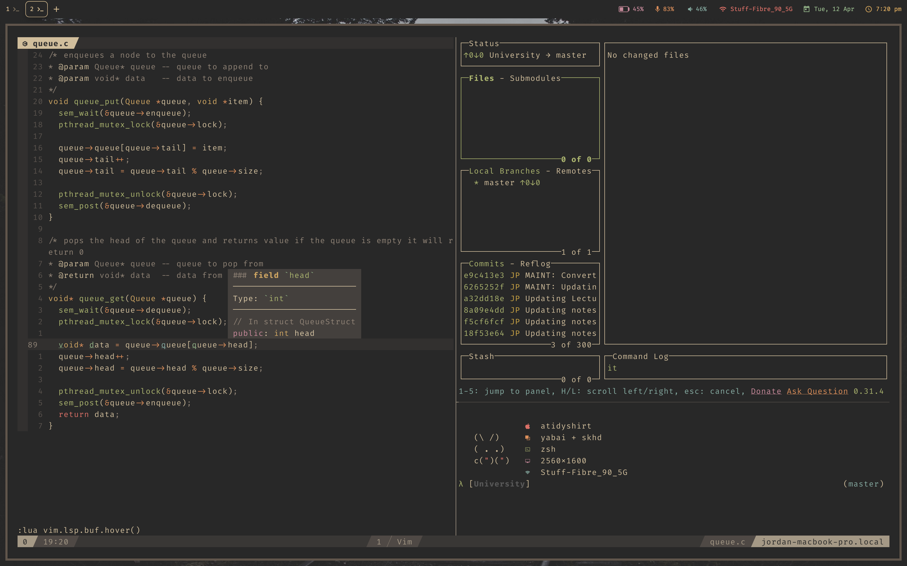

# Terminal



The terminal configuration that I use on every machine. This is my full dotfiles for the terminal. I use kitty, neovim, tmux and zsh. I also use exa as my ls replacement. This is designed to be run in conjunction with my tmux config, as this will allow you to use commands like `gt` and `gy` to go to a tmux terminal, and then `C-o` to get back into vim.

### Features:

* Tmux Integration (tpipeline, tmux-navigator, harpoon)
* Code Completion (native lsp)
* Git integration (fugative)
* File persistance (harpoon)
* Installer

Keybinds for these features can be found in `./lua/keymap.lua`

### Install:

The installer file will run through and check that the requirements are installed and then will go through and install fonts, configs and put in their respective directories.

This will clear old configs and save them in a file called `$FILE_NAME.old`.

To install my configs, run the following

```
cd ~/.config
git clone https://github.com/atidyshirt/nvim
cd ~/.config/nvim
./install.sh
```
