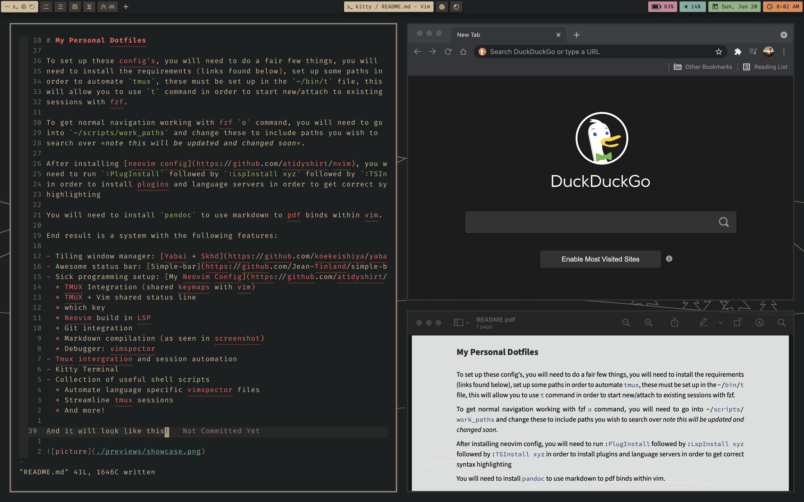

# My Personal Dotfiles

To set up these config's, you will need to do a fair few things, you will
need to install the requirements (links found below), set up some paths in
order to automate `tmux`, these must be set up in the `~/bin/t` file, this
will allow you to use `t` command in order to start new/attach to existing
sessions with fzf.

To get normal navigation working with fzf `o` command, you will need to go
into `~/scripts/work_paths` and change these to include paths you wish to
search over *note this will be updated and changed soon*.

After installing [neovim config](https://github.com/atidyshirt/nvim), you will
need to run `:PlugInstall` followed by `:LspInstall xyz` followed by `:TSInstall xyz` 
in order to install plugins and language servers in order to get correct syntax
highlighting

You will need to install `pandoc` to use markdown to pdf binds within vim.

End result is a system with the following features:

- Tiling window manager: [Yabai + Skhd](https://github.com/koekeishiya/yabai)
- Awesome status bar: [Simple-bar](https://github.com/Jean-Tinland/simple-bar)
- Sick programming setup: [My Neovim Config](https://github.com/atidyshirt/nvim)
  * TMUX Integration (shared keymaps with vim)
  * TMUX + Vim shared status line
  * which key
  * Neovim build in LSP
  * Git integration 
  * Markdown compilation (as seen in screenshot)
  * Debugger: vimspector
- Tmux intergration and session automation
- Kitty Terminal
- Collection of useful shell scripts
  * Automate language specific vimspector files
  * Streamline tmux sessions
  * And more!

And it will look like this!

