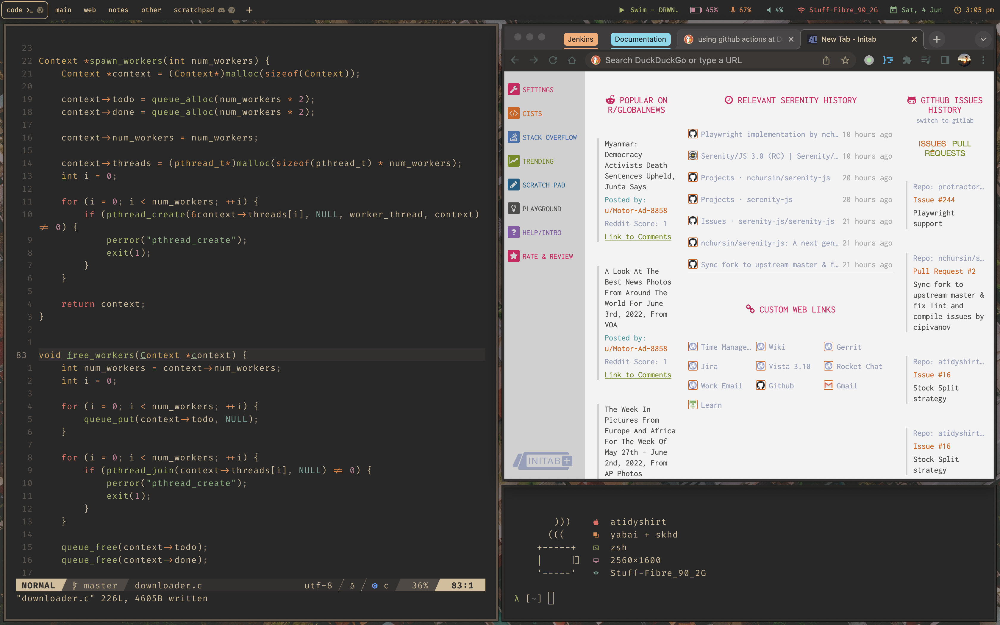
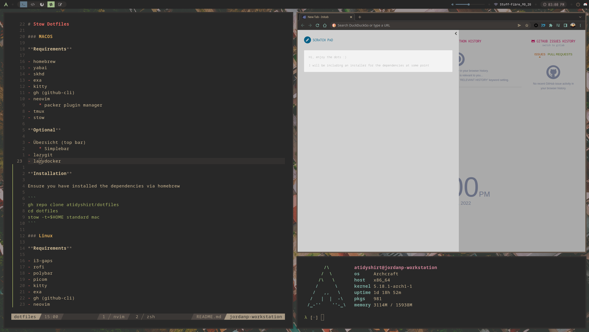

# Stow Dotfiles

### MACOS

**Showcase**



**Installation**

```sh { tangle: ./install/install_mac.sh }
# Installing homebrew
/bin/bash -c "$(curl -fsSL https://raw.githubusercontent.com/Homebrew/install/HEAD/install.sh)"

# Using Stow to stow both the standard and macOS dotfiles
gh repo clone atidyshirt/dotfiles
cd dotfiles
stow -t=$HOME standard mac

# Install dependencies from Brewfile in ~/ directory
cd
brew bundle
```

### Linux

**Showcase**



**Installation**

Ensure you have installed the dependencies via package manager on system.

- If you are on archcraft, use the following commands to do so:
    * `sudo pacman -S archcraft-i3wm`
    * `yay -S rofi polybar picom kitty exa gh neovim tmux stow nvim-packer-git`
    * Alternatively you can install exa, kitty, neovim, tmux, stow from `homebrew`

```sh { tangle: ./install/install_linux.sh }
# Installing homebrew
/bin/bash -c "$(curl -fsSL https://raw.githubusercontent.com/Homebrew/install/HEAD/install.sh)"

# Using Stow to stow both the standard and macOS dotfiles
gh repo clone atidyshirt/dotfiles
cd dotfiles
stow -t=$HOME standard linux

# Install dependencies from Brewfile in ~/ directory
cd
brew bundle
```
