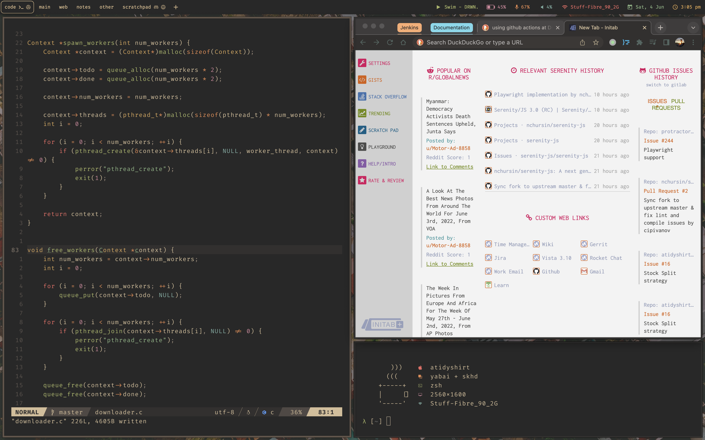
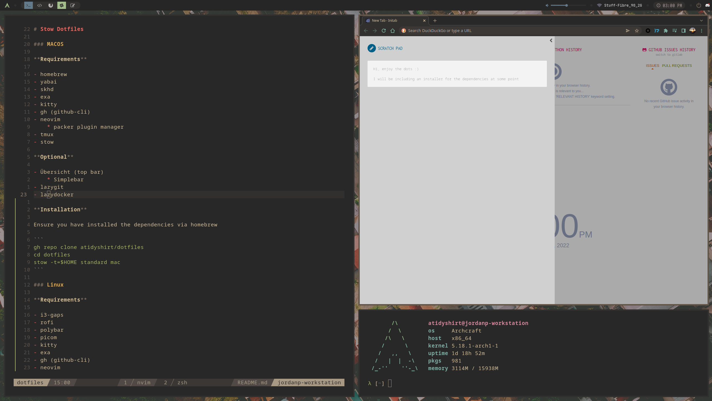

# Dotfiles (Nix)

macOS and Linux configs are driven by **Nix flakes**, **nix-darwin** (Mac), and **Home Manager**. Older **GNU Stow + Homebrew Bundle** flows are removed so packages are not declared twice.

**→ Install / update:** [docs/nix-guide.md](./docs/nix-guide.md)  
Index: [docs/README.md](./docs/README.md)

### macOS

**Showcase**



**Apply this flake** (repeat after edits): use **`nix run`** with the nix-darwin rev pinned in **`flake.lock`** — see [docs/nix-guide.md](./docs/nix-guide.md). `darwin-rebuild` is often not on **`PATH`**; that workflow does not rely on it.

### Linux

**Showcase**



```sh
home-manager switch --flake .#jordanp@generic-linux
```

Use `jordanp@generic-linux-aarch64` on ARM Linux. See [docs/nix-guide.md](./docs/nix-guide.md).

### Repo layout

| Path | Contents |
|------|-----------|
| `users/jordanp/config/` | App configs: cross-platform (nvim, wezterm, …); **Linux** (hypr, rofi, …); **macOS** (sketchybar assets, aerospace, borders, startpage). |
| `users/jordanp/home/` | Dotfiles linked into `$HOME` (`.zshrc`, `.zprofile`, `.tmux.conf`, …). |
| `users/jordanp/bin/` | Linked wholesale to **`~/.bin`** (on `PATH` via `.zprofile`). |
| `users/jordanp/modules/` | HM entrypoints: `default.nix`, `linux.nix`, `darwin.nix`; subdirs mirror `config/*` (e.g. `tmux/`, `wezterm/`, `sketchybar/`). |
| `users/jordanp/packages.nix` | Shared `home.packages` for every host. |
| `machines/` | Host composition: `darwin.nix` (nix-darwin + macOS-only HM imports), `nixos.nix` (extra HM modules for Linux standalone). |
| `nix/` | macOS system module: `darwin-system.nix`. |
| `scripts/` | Non-HM extras (e.g. `scripts/legacy/`) |

**Layout:** `flake.nix` sets **`dotfilesRoot`** to **`users/jordanp`** so HM paths stay short (`config/…`, `home/…` relative to that tree). **machines/** chooses which modules run on each OS (similar in spirit to [mitchellh/nixos-config](https://github.com/mitchellh/nixos-config)).

Legacy `server/` shell snippets live under `scripts/legacy/` for reference. macOS Brewfile snapshot: `docs/Brewfile.mac-legacy`.

Linux: `users/jordanp/modules/linux.nix` (via `machines/nixos.nix`) pulls in `hypr/`, `rofi/`, `picom/`, `libinput-gestures/`. macOS: `users/jordanp/modules/darwin.nix` (from `machines/darwin.nix`) pulls in `sketchybar/` and `aerospace/`.
