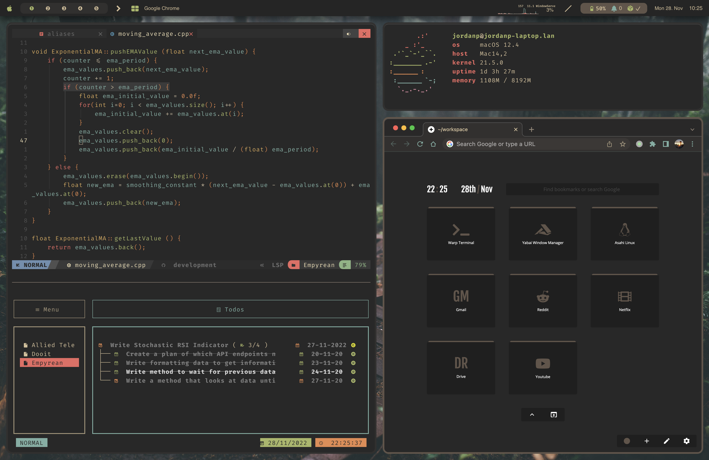

# Stow Dotfiles

### MACOS

**Requirements**

- homebrew
- yabai
- skhd
- exa
- kitty
- gh (github-cli)
- neovim
    * packer plugin manager
- tmux
- stow

**Optional**

- Übersicht (top bar)
    * Simplebar
- lazygit
- lazydocker

**Showcase**



**Installation**

Ensure you have installed the dependencies via homebrew

```
gh repo clone atidyshirt/dotfiles
cd dotfiles
stow -t=$HOME standard mac
```

### Linux

**Requirements**

- i3-gaps
- rofi
- polybar
- picom
- kitty
- exa
- gh (github-cli)
- neovim
    * packer plugin manager
- tmux
- stow

**Optional**

- Übersicht (top bar)
    * Simplebar
- lazygit
- lazydocker

**Showcase**


**Installation**

Ensure you have installed the dependencies via package manager on system.

- If you are on archcraft, use the following commands to do so:
    * `sudo pacman -S archcraft-i3wm`
    * `yay -S rofi polybar picom kitty exa gh neovim tmux stow nvim-packer-git`

```
gh repo clone atidyshirt/dotfiles
cd dotfiles
stow -t=$HOME standard linux
```
