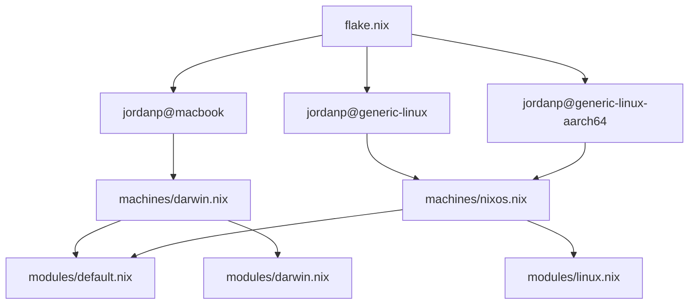

# Repository structure

This page describes how the Nix tree is laid out and how evaluation flows from
`flake.nix` into Home Manager modules and on-disk config.

## Top-level layout

| Path | Role |
|------|------|
| `flake.nix` | Inputs, `dotfilesRoot`, `darwinConfigurations`, `homeConfigurations`. |
| `machines/darwin.nix` | nix-darwin system module + Home Manager for macOS. |
| `machines/nixos.nix` | List of Home Manager modules for Linux (name is historical). |
| `users/jordanp/` | All user-scoped config; `dotfilesRoot` points here. |
| `users/jordanp/config/` | App configs: cross-platform (nvim, wezterm, …); Linux (hypr, rofi, …); macOS (SketchyBar, AeroSpace, …). |
| `users/jordanp/home/` | Files linked into `$HOME` (`.zshrc`, `.tmux.conf`, …). |
| `users/jordanp/bin/` | Linked to **`~/.bin`** (`PATH` via `.zprofile`). |
| `users/jordanp/modules/` | Home Manager entrypoints: `default.nix`, `linux.nix`, `darwin.nix`; subdirs mirror `config/*`. |
| `users/jordanp/packages.nix` | Shared `home.packages` for every host. |

**`dotfilesRoot`** is set to **`users/jordanp`** so paths inside modules stay
short (`config/…`, `home/…` relative to that tree). **machines/** chooses which
module set runs on each OS (similar in spirit to
[mitchellh/nixos-config](https://github.com/mitchellh/nixos-config)).

## Flake targets

Each apply command uses a **`user@host`-style** name. The flake defines three
targets:

| Target | Flake output | Notes |
|--------|--------------|-------|
| `jordanp@macbook` | `darwinConfigurations."jordanp@macbook"` | nix-darwin + Home Manager; `machines/darwin.nix`. |
| `jordanp@generic-linux` | `homeConfigurations."jordanp@generic-linux"` | Home Manager on **x86_64-linux**; `machines/nixos.nix`. |
| `jordanp@generic-linux-aarch64` | `homeConfigurations."jordanp@generic-linux-aarch64"` | Home Manager on **aarch64-linux**; same module list as generic-linux. |

`dotfilesRoot` and `username` are passed as **`specialArgs` / `extraSpecialArgs`**
on every target.

## Evaluation flow

1.  **`flake.nix`** sets **`username`**, **`dotfilesRoot`**, and three
    entrypoints: **`darwinConfigurations."jordanp@macbook"`** and two
    **`homeConfigurations`** attributes for Linux.
2.  **macOS:** `machines/darwin.nix` configures the system (fonts, Nix settings,
    allowed unfree packages, user home) and wires Home Manager to import
    **`modules/default.nix`** and **`modules/darwin.nix`**.
3.  **Linux:** `import ./machines/nixos.nix` expands to **`modules/default.nix`**
    plus **`modules/linux.nix`**, with an extra inline module in `flake.nix` for
    unfree predicates on Linux.

Shared imports in **`modules/default.nix`** include shells, git, nvim, tmux,
WezTerm, and other cross-platform pieces; OS-specific modules add Hyprland,
rofi, and other Linux tools, or SketchyBar and AeroSpace on macOS.

## See also

*   [Documentation index](index.md)
*   [macOS (nix-darwin)](machines/darwin.md)
*   [Linux (Home Manager)](machines/nixos.md)
